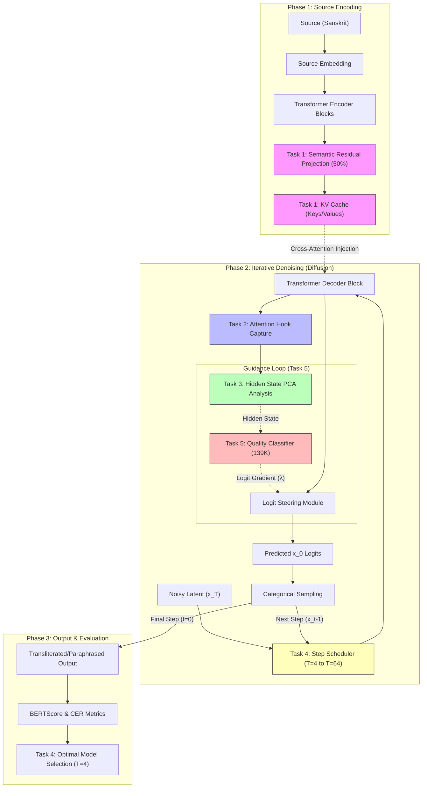

# Sanskrit Diffusion Model Architecture

This diagram visualizes the core transformer-based D3PM architecture and highlights how the five engineering tasks modify or analyze the generation pipeline.

## Task Mapping Summary

| Task | Component | Description |
| :--- | :--- | :--- |
| **Task 1** | **KV Cache** | Pre-computes source representations to avoid redundant $O(T)$ encoding. |
| **Task 2** | **Attention Hooks** | Captures cross-attention weights to measure semantic drift and TF-IDF correlation. |
| **Task 3** | **PCA Steering** | extracts concept vectors from hidden states to control output diversity along $\alpha$ spectrum. |
| **Task 4** | **Ablation Studies** | Benchmarks $T$ across a scale to find the quality 'knee' (Optimal $T=4$). |
| **Task 5** | **CFG Guidance** | Injects classifier gradients into logits to steer generation toward high-BERTScore states. |

---
*Note: Darker labels represent task-specific modules added during the optimization phase.*
